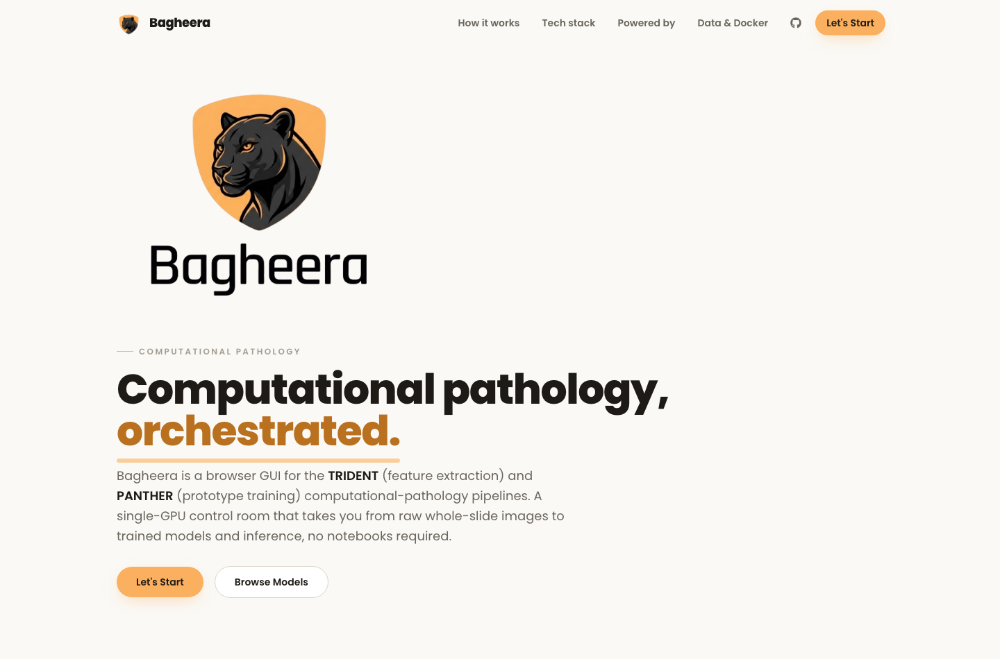
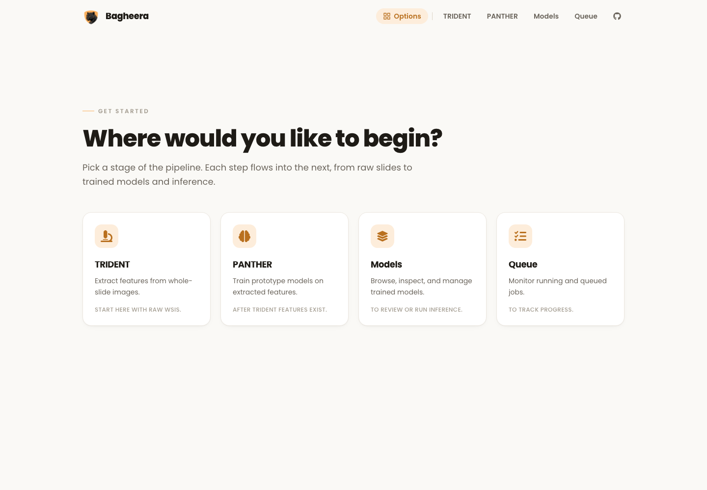
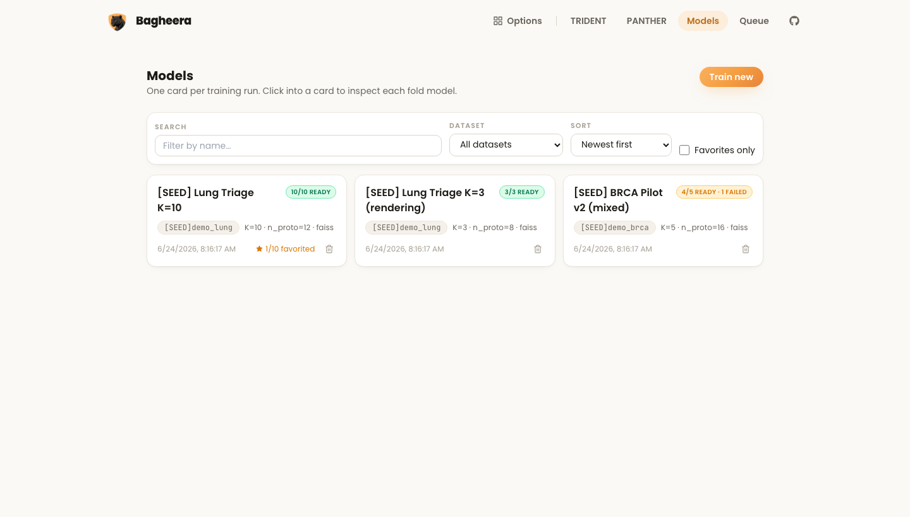
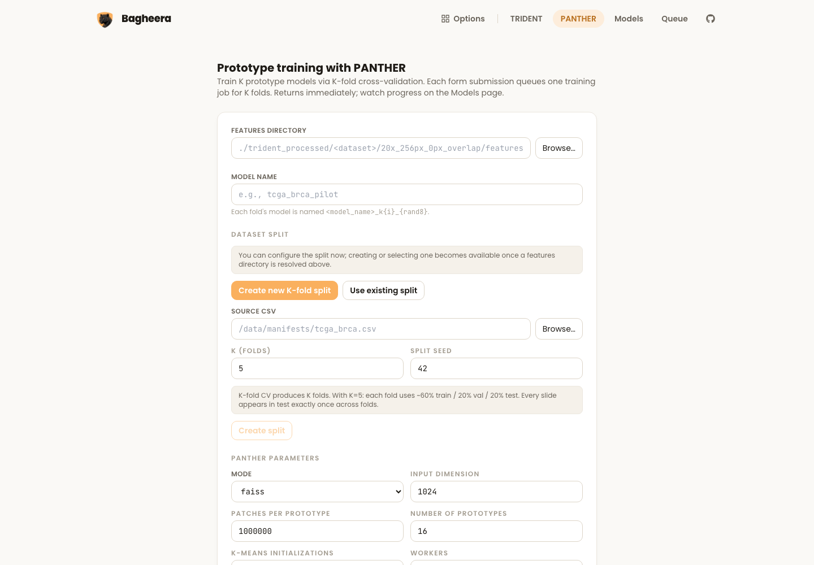
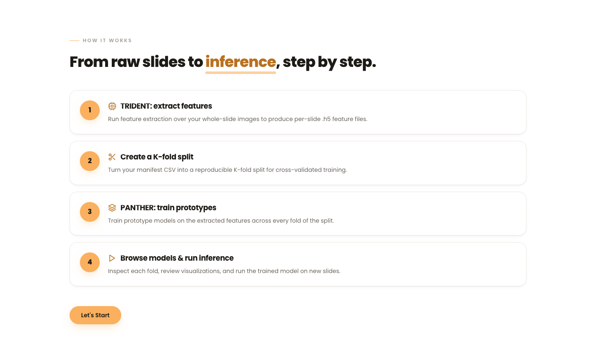
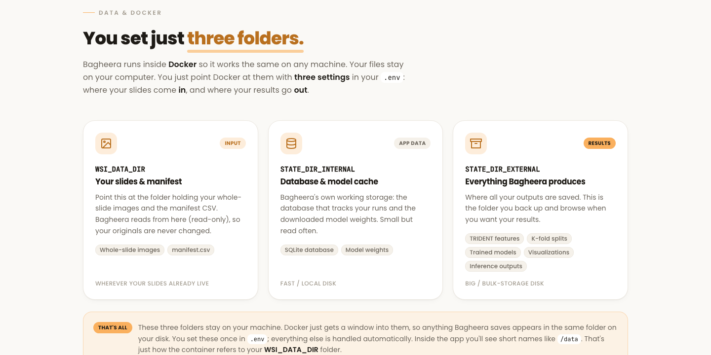
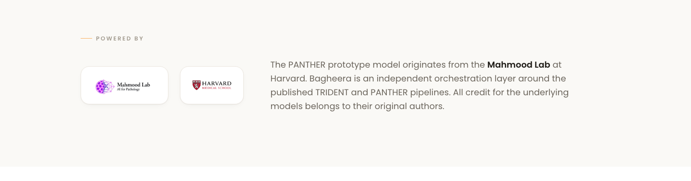

<p align="center">
  
</p>

<h3 align="center">A browser control room for computational-pathology pipelines.</h3>

<p align="center">
  Bagheera is a single-user, single-GPU web GUI that orchestrates the
  <a href="https://github.com/mahmoodlab/TRIDENT">TRIDENT</a> (feature extraction) and
  <a href="https://github.com/mahmoodlab/PANTHER">PANTHER</a> (prototype training) pipelines —
  taking you from raw whole-slide images to trained models and inference, no notebooks required.
</p>

<p align="center">
  
  
  
  
  
  
  
</p>

---

## Screenshots

| Landing | Get started |
| :---: | :---: |
|  |  |
| **Models browser** | **PANTHER training** |
|  |  |

<details>
<summary><b>More screenshots</b> — how it works · data &amp; docker · powered by</summary>





</details>

---

## Highlights

- **Guided, GUI-first workflow** — a landing page and a four-card launcher (TRIDENT · PANTHER ·
  Models · Queue) walk you through the pipeline; no command line required to run a job.
- **End-to-end pipeline** — feature extraction → reproducible K-fold splits → prototype training
  → model browsing → inference, all from the browser.
- **Async job queue** — every TRIDENT/PANTHER/viz/inference run is queued and processed by a
  background worker; the UI polls for live status so long jobs never block the request.
- **Model management** — browse trained model groups, favorite them, inspect per-fold results
  and visualizations (heatmaps, UMAP, top-K), and **delete** bad runs (DB rows + on-disk
  artifacts) in one click.
- **Smart CSV handling** — manifest CSVs are validated for a `slide_id` column and the `.tif`
  extension is auto-stripped so PANTHER always gets clean slide IDs.
- **Sandboxed file access** — every path the UI touches is resolved against
  `TRIDENT_ALLOWED_ROOTS`, blocking `../` traversal and symlink escapes.
- **Docker-first deployment** — one `docker compose up` on the GPU box; bind mounts map your host
  folders into the container, explained visually in the in-app **Data &amp; Docker** section.

---

## How it works

```
   ┌───────────┐     ┌───────────┐     ┌───────────┐     ┌──────────────────────┐
   │  TRIDENT  │ ──▶ │  K-fold   │ ──▶ │  PANTHER  │ ──▶ │  Models & Inference  │
   │  extract  │     │  split    │     │  train    │     │  browse · run · view │
   │  features │     │  manifest │     │ prototypes│     │  visualizations      │
   └───────────┘     └───────────┘     └───────────┘     └──────────────────────┘
```

1. **TRIDENT — extract features.** Run feature extraction over your whole-slide images to produce
   per-slide `.h5` feature files.
2. **Create a K-fold split.** Turn your manifest CSV into a reproducible K-fold split for
   cross-validated training.
3. **PANTHER — train prototypes.** Train prototype models on the extracted features across every
   fold of the split.
4. **Browse & run inference.** Inspect each fold, review visualizations, and run the trained model
   on new slides.

---

## Architecture

```
browser ──▶ FastAPI (:8000) ──▶ SQLite (bagheera.db)
                │                     │
             routes/            worker thread
        (one per resource)      (polls jobs every 2s, runs subprocesses)
                │
            services/
   ┌────────────┴─────────────┐
 fs.py · splitter.py     panther_train.py · post_train_viz.py
 runner.py · worker.py   inference_job.py · visualization.py
```

- **Backend** (`backend/`): FastAPI app with one route module per resource
  (`fs`, `trident`, `panther`, `splits`, `models`, `jobs`, `queue`, `inference`, `viz`,
  `notes`, `labels`, `runs`), thin services, and a polling worker thread that executes jobs
  via `subprocess` so the API stays responsive.
- **Frontend** (`frontend/`): Vite + React + TypeScript + Tailwind SPA. `src/lib/api.ts` is the
  single typed FE↔BE contract; pages poll job status every 2 s.
- **Database**: SQLite via SQLAlchemy. Schema is created with `create_all()` (no migration
  framework) — delete `bagheera.db` after schema changes.

See [`docs/structure.md`](docs/structure.md) for the full tour.

---

## Tech stack

| Layer | Tools |
| --- | --- |
| **Frontend** | React 18, TypeScript, Vite, TailwindCSS, react-icons, framer-motion |
| **Backend** | Python 3.10+, FastAPI, Uvicorn, SQLAlchemy (SQLite), Pydantic v2, pandas |
| **Pipelines** | [TRIDENT](https://github.com/mahmoodlab/TRIDENT), [PANTHER](https://github.com/mahmoodlab/PANTHER) (+ FAISS, PyTorch) |
| **Deployment** | Docker / Docker Compose, nginx (serves the built SPA, proxies `/api`) |

---

## Quick start

### Option A — Docker (recommended, GPU box)

```bash
cp .env.example .env          # set WSI_DATA_DIR, STATE_DIR_*, CUDA image tag, etc.
docker compose build
docker compose up -d          # UI at http://localhost:8080
```

Path/`.env` setup is the one thing worth reading carefully — see
[`docs/docker.md`](docs/docker.md) and the visual host↔container map in
[`docs/env-paths.md`](docs/env-paths.md) (also rendered in the app's **Data &amp; Docker** section).

### Option B — Local dev (two terminals)

**Backend**
```bash
cd backend
python3 -m venv .venv && source .venv/bin/activate
pip install -r requirements.txt
cp .env.example .env          # backend/.env.example — set TRIDENT_ALLOWED_ROOTS, repo paths
uvicorn app.main:app --reload --port 8000
```

**Frontend**
```bash
cd frontend
npm install
npm run dev                   # http://localhost:5173 (proxies /api → :8000)
```

**Seed demo data** (optional, to explore the UI without running real jobs):
```bash
cd backend && python scripts/seed_demo.py
```

API docs (OpenAPI/Swagger): <http://localhost:8000/docs>.

---

## Configuration

The backend reads paths from environment variables. The critical ones:

| Variable | Purpose |
| --- | --- |
| `TRIDENT_ALLOWED_ROOTS` | Colon-separated absolute paths the file browser/runners may access. **The security boundary** — every path is resolved inside one of these. |
| `WSI_DATA_DIR` | (Docker) Host folder with your slides + manifest CSV; mounted read-only at `/data`. |
| `STATE_DIR_INTERNAL` / `STATE_DIR_EXTERNAL` | (Docker) Host folders for DB + caches (fast disk) and bulk outputs (big disk). |
| `TRIDENT_REPO_PATH` / `PANTHER_REPO_PATH` | Checkouts of the two pipelines the backend invokes. |
| `BAGHEERA_DB_PATH` | SQLite file path (default `./bagheera.db`). |

Full reference: [`docs/env-paths.md`](docs/env-paths.md).

---

## Project structure

```
backend/         FastAPI app
  app/
    routes/      one module per resource (fs, trident, panther, models, queue, …)
    services/    job handlers, worker, splitter, viz, runner
    db/          SQLAlchemy models + session
  scripts/       run_trident.sh, run_panther.sh, seed_demo.py
frontend/
  src/
    pages/       LandingPage, StartPage, Trident/Panther training, Models, Inference, Queue
    components/  UI primitives, landing sections, forms, modals
    lib/api.ts   typed FE↔BE contract
  public/        logos and static assets
docs/            architecture & subsystem docs (start with structure.md)
docker-compose.yml
```

---

## Documentation

| Doc | What it covers |
| --- | --- |
| [`docs/structure.md`](docs/structure.md) | Architecture & how the pieces fit together |
| [`docs/backend.md`](docs/backend.md) | Routes, services, worker, job handlers, config |
| [`docs/frontend.md`](docs/frontend.md) | Pages, components, design system |
| [`docs/database.md`](docs/database.md) | Schema, tables, relationships |
| [`docs/queue-design.md`](docs/queue-design.md) | Async job queue mechanics |
| [`docs/docker.md`](docs/docker.md) | Docker build & deployment |
| [`docs/env-paths.md`](docs/env-paths.md) | `.env`, paths, host ↔ container mapping |
| [`docs/tests.md`](docs/tests.md) | Testing approach |

---

## Acknowledgements

<p>
  
  &nbsp;&nbsp;
  
</p>

The prototype models are powered by the **[Mahmood Lab](https://mahmoodlab.org/)** at Harvard
Medical School. Bagheera is an independent orchestration layer around the published
**[TRIDENT](https://github.com/mahmoodlab/TRIDENT)** and
**[PANTHER](https://github.com/mahmoodlab/PANTHER)** pipelines — all credit for the underlying
models belongs to their original authors.

## Team

- **Shahar Ishay** — [LinkedIn](https://www.linkedin.com/in/shahar-ishay-831762303/)
- **Daniel Rubinstein** — [LinkedIn](https://www.linkedin.com/in/daniel-rubinstein-900842398/)
- **Dolfin Varshev** — [LinkedIn](https://www.linkedin.com/in/dolfin-varshev/)
